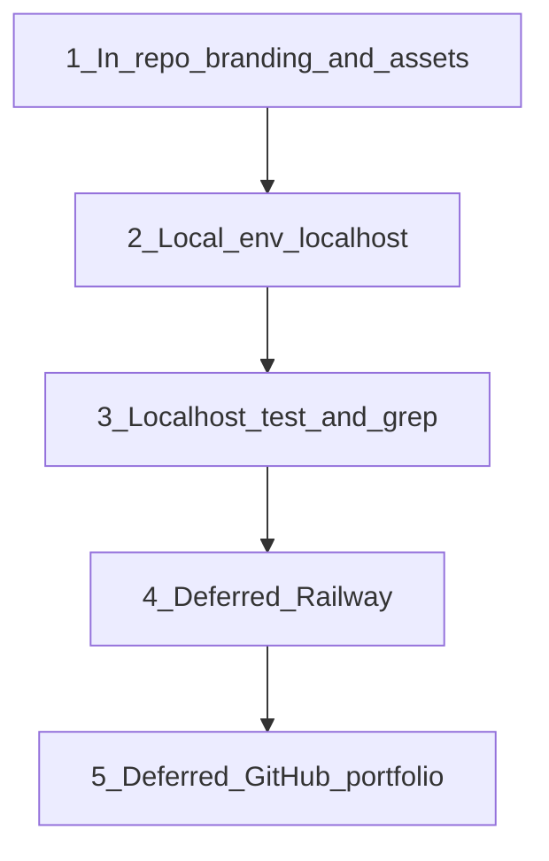

# Tessro → Fliccs Rebrand Plan

**Status:** Phases A–B done locally (2026-08-05). Railway / GitHub still deferred.  
**Goal:** Rename Tessro to Fliccs. Keep product behavior the same. Prove it on localhost first. Railway, GitHub, portfolio, and domain work come **last**.

---

## Execution order (local first)

| When | Phase | What |
|------|-------|------|
| **Now** | A — Branding | Strings, package name, logos, favicon, docs |
| **Now** | B — Local verify | Localhost env, create/join, Stream Mode, `rg tessro` |
| **Later** | C — Railway | Delete old project, new Fliccs deploy, prod env |
| **Later** | D — External IDs | GitHub rename, portfolio, folder rename, Ko-fi |

Do **not** touch Railway / GitHub / portfolio until local Fliccs looks and works right.

---

## Local env for testing (Phase B)

Keep localhost — no Railway URL yet.

| File | Local values |
|------|----------------|
| `client/.env` | `VITE_SERVER_URL=http://localhost:3001`; drop or comment `tessro.com` / old Railway lines |
| `server/.env` | `CLIENT_URL=http://localhost:5173` (or whatever Vite port you use); leave Cloudflare keys alone |

Dev CORS already allows localhost `5173–5175` when `NODE_ENV` is not production — local sockets should work without a public origin.

For meta/`og:url` during the local phase: use a placeholder comment, omit, or temporarily leave a non-live string — swap to the Railway URL only in Phase C.

---

## Do NOT blindly rename (any phase)

| Item | Action |
|------|--------|
| Twilio hosts + hardcoded TURN creds in `client/src/hooks/useWebRTC.js` | **Keep**; continue 24h “TURN Server Maintenance” rotation |
| `ServerStatusTimer.jsx` | Leave logic |
| Unused `CLOUDFLARE_TURN_*` in `server/.env` | Leave keys; no need to recreate for rebrand |
| Socket event names (`session:*`, `sync:*`, `webrtc:*`) | Leave |
| Old `tessro.com` | Abandon; no redirects possible |

There are **no** cron jobs, databases, Redis keys, cookies, or localStorage keys named Tessro in this codebase.

---

## Phase A — In-repo branding (do first)

**Casing:**
- Display: **Fliccs**
- Package / URLs / filenames: **fliccs**
- Product tier: **Fliccs Premium**

### Meta / package / server

- `client/index.html` — title, description, OG tags, favicon href; defer real `og:url` until Phase C if needed
- `package.json` + `package-lock.json` — `"name": "fliccs"`
- `server/src/index.js` — health + listen strings → Fliccs
- `client/.env` — remove `tessro.com` / tessro Railway comments; set localhost as above

### UI copy

- `client/src/App.jsx` — footer
- `client/src/components/Landing.jsx` — alt text; portfolio href can stay pointing at old slug until Phase D, or update path early if you prefer
- `client/src/components/Layout/PageLayout.jsx`
- `client/src/components/Session/Participants.jsx` — invite: `Join the watch party on Fliccs!`
- `client/src/components/Session/AutoJoinModal.jsx`
- `client/src/components/VideoPlayer/index.jsx`
- `client/src/components/Premium/PremiumModal.jsx`
- Legal: `TermsModal.jsx`, `PrivacyPolicyModal.jsx`, `TermsPage.jsx`, `PrivacyPage.jsx`, `RefundPage.jsx`

### Docs

- `README.md` — name/copy to Fliccs; live URL can say “coming soon” or localhost until Phase C
- Optional (gitignored): `context.md`, `monetization_plan.md`, `pre_monetization_plan.md`

### Assets

| Asset | Action |
|-------|--------|
| `client/src/assets/logo.png` | New wordmark: same purple mark + **fliccs** |
| `client/public/tessro-icon.png` | → `fliccs-icon.png` + update `index.html` |
| `client/public/banner.png`, `documentation/banner*` | Regenerate with Fliccs wordmark |
| `symbol.png`, promo images | Keep unless they contain the word tessro |

Invite links use `window.location.origin` — on localhost they stay localhost. Fine for testing.

Tailwind `brand-*` tokens stay — they are not Tessro-named.

---

## Phase B — Localhost verification (do second)

1. `npm` / workspace: client `dev` + server `dev` (or your usual local pair).
2. `GET http://localhost:3001/health` → Fliccs string.
3. Landing: title, favicon, logo say Fliccs; spot-check legal, premium, invite clipboard.
4. Two-browser create/join on localhost (Sync Mode).
5. Stream Mode still works (Twilio TURN unchanged — may need fresh creds if the 24h window expired).
6. `rg -i tessro` excluding `node_modules` / `.git` — expect zero hits (or only intentional deferred notes like “Railway later”).

**Done when:** product is Fliccs end-to-end on your machine. No Railway or GitHub required yet.

---

## Phase C — Railway (deferred)

Do this only after Phase B is green.

1. Delete old Tessro Railway project **or** stop using it.
2. New project `fliccs` → connect repo → deploy (`npm run build` + `npm start`).
3. Set on Railway:
   - `CLIENT_URL=https://<new-service>.up.railway.app`
   - `VITE_SERVER_URL` — same URL, then **rebuild** so the client bundle embeds it
4. Confirm `GET https://<railway-url>/health`.
5. Update README live link + `og:url` to the Railway URL; redeploy if needed.

**No custom domain required.** Optional later: buy `fliccs.com` and attach as Railway custom domain.

### What deleting the old Railway project affects

| What | Effect |
|------|--------|
| Old `*.up.railway.app` URL | Gone (bookmarks / old links) |
| `tessro.com` | Already lost — no change |
| Env vars / deploy history | Gone; recreate env on new project |
| Live sessions | Drop (in-memory anyway) |
| Twilio TURN in git | Unaffected |
| GitHub / local code | Unaffected |

---

## Phase D — External identities (deferred last)

1. GitHub: rename `Tessro` → `Fliccs`; update local remote.
2. Portfolio: `rajinkhan.com/projects/fliccs` + Landing href.
3. Optional: local folder `ACTIVE/TESSRO` → `ACTIVE/FLICCS`.
4. Ko-fi slug only if/when you create it.

---

## Checklist

### Now (local)

- [x] Create Fliccs wordmark logo + banners; rename favicon to `fliccs-icon.png`
- [x] Update all UI / legal / meta / package / README / server strings Tessro → Fliccs
- [x] Point local `.env` at localhost (no tessro.com)
- [x] Verify on localhost: health, socket session create, UI brand, final `tessro` grep clean
- [ ] Manual: Stream Mode after refreshing Twilio TURN creds (current `lastResetTimestamp` is expired)

### Later (external)

- [ ] Delete old Railway project; create Fliccs Railway project; set prod `CLIENT_URL` + `VITE_SERVER_URL`; deploy
- [ ] Rename GitHub repo; update portfolio slug/href; update README live link

---

## Short answers (for when you get to Railway)

**Do you need a custom domain?** No — `*.up.railway.app` is enough for this fullstack app.

**Can you delete the old Railway project and start fresh?** Yes — no DB/cron to migrate; only host + env + URL.

---

## Explicit non-goals

- Buying a domain or DNS cutover (deferred indefinitely until you want it)
- Doing Railway / GitHub / portfolio before local verification
- Cloudflare TURN migration / Twilio workflow changes
- Monetization implementation
- Recovering `tessro.com`
- Visual redesign beyond name/wordmark
